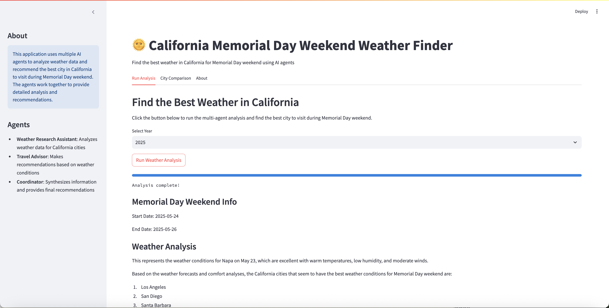

# California Weather Travel Planner

A multi-agent application that helps you find the best weather in California for Memorial Day weekend using the Strands Agents SDK and OpenWeather API.



## Features
- Uses multiple specialized AI agents working together:
  - Weather Research Assistant: Analyzes weather data for California cities
  - Travel Advisor: Makes recommendations based on weather conditions
  - Coordinator: Synthesizes information and provides final recommendations
- Fetches real-time weather data and forecasts from OpenWeather API
- Analyzes weather patterns for major California cities
- Provides detailed recommendations with reasoning

## Setup

1. Install dependencies:
```bash
pip install -r requirements.txt
```

2. Configure your API key in `.env`:
```
OPENWEATHER_API_KEY=your_api_key_here
```

3. Run the application:
```bash
python travel_weather_app.py
```

## How It Works

1. The Weather Research Assistant gathers weather data for major California cities
2. The Travel Advisor analyzes this data to determine ideal destinations
3. The Coordinator synthesizes the information and provides a final recommendation

## Requirements

- Python 3.8+
- OpenWeather API key (free tier works fine)
- Internet connection to access weather data
